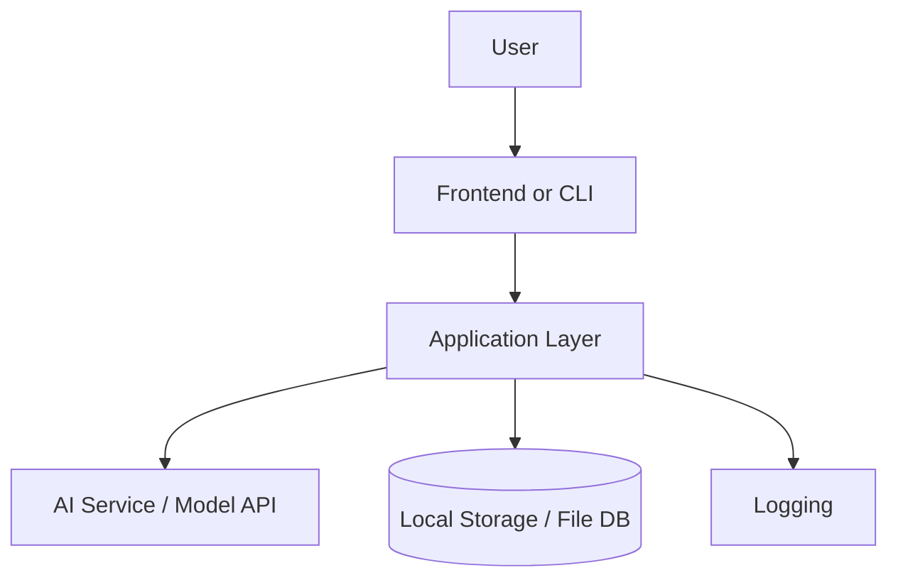

# Project Template – AI Builders Hackathon 2026

Use this repository as a starter template for hackathon submissions.

## Suggested Folder Structure

```text
project-root/
├─ src/
│  ├─ main.py
│  └─ modules/
├─ tests/
├─ docs/
│  ├─ architecture.md
│  └─ demo-script.md
├─ data/                  # optional sample/non-sensitive data
├─ .github/
│  └─ workflows/
│     └─ ci.yml
├─ README.md
├─ LICENSE
├─ requirements.txt       # or package.json / pyproject.toml
└─ .env.example
```

## Example Project Layout (Minimal)

- `src/main.py`: entry point
- `src/modules/inference.py`: model/API interaction
- `src/modules/preprocess.py`: data processing
- `tests/test_smoke.py`: smoke tests
- `docs/architecture.md`: architecture and component notes
- `docs/demo-script.md`: demo walkthrough

## Architecture Diagram (Markdown)



## Demo Instructions Template

Copy into your project README:

```md
## Demo

### 1. Problem
Briefly describe the problem.

### 2. Solution
Explain your approach and AI usage.

### 3. Run Locally
```bash
# install dependencies
pip install -r requirements.txt

# run app
python src/main.py
```

### 4. Demo Video
Add an unlisted YouTube/Drive link (2–5 min).

### 5. Team
- Name – Role
- Name – Role
```

## Submission Checklist

- [ ] Public GitHub repository
- [ ] Working instructions
- [ ] Demo video link
- [ ] Team list and roles
- [ ] AI Assistance disclosure
